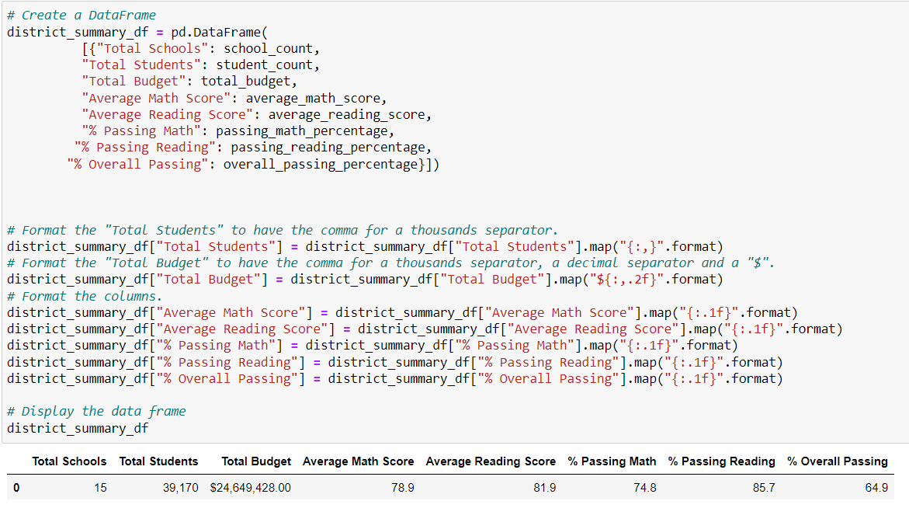
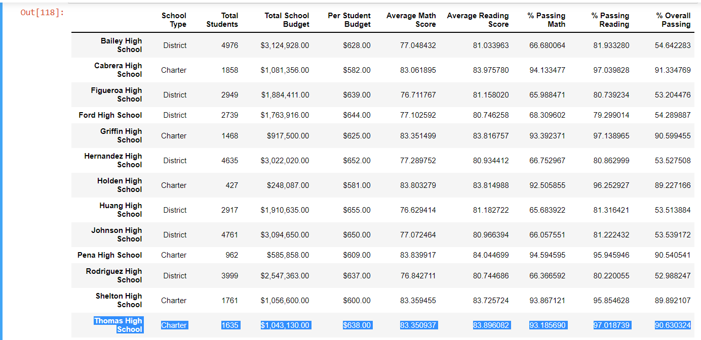
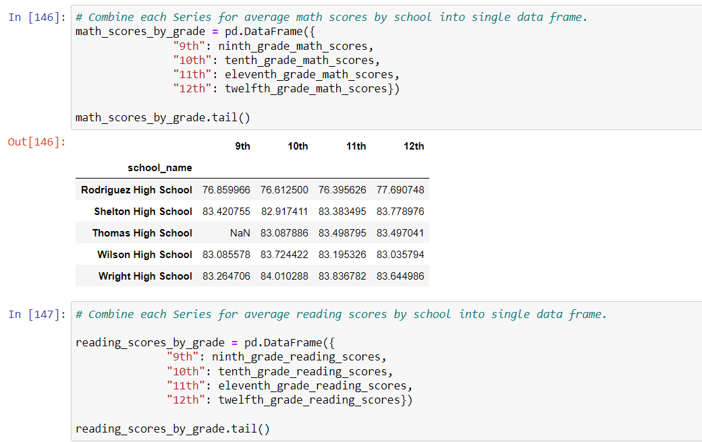
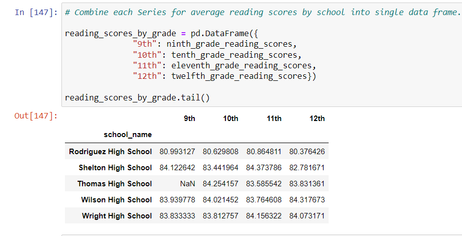
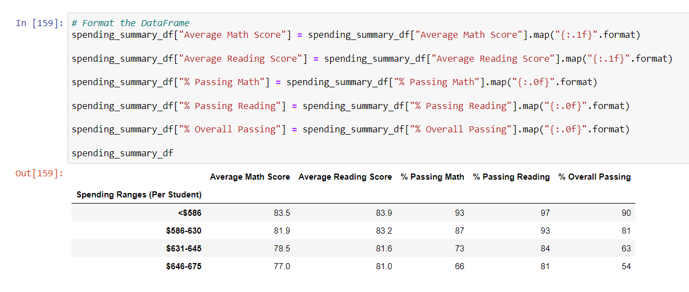
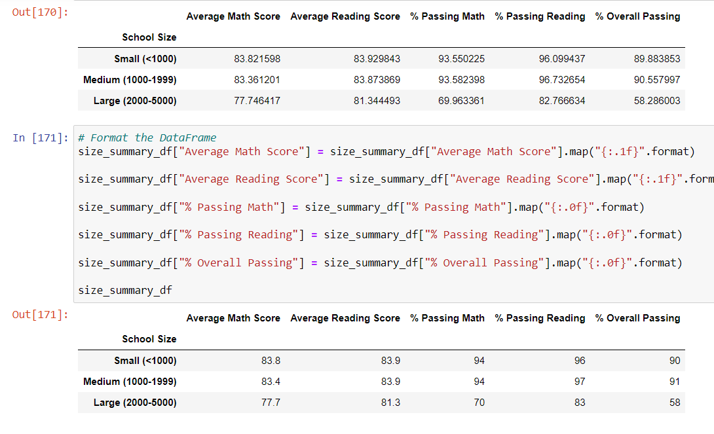
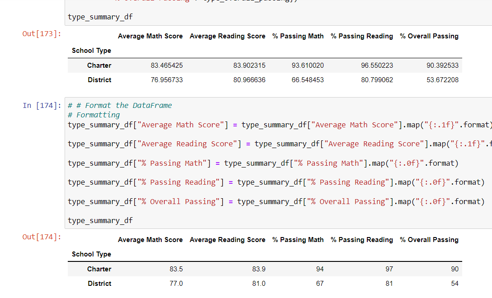

# School_District_Analysis

## Overview of School_District_Analysis

### Purpose
Thomas High School's 9th grade reading and math scores were altered for academic dishonesty. We have been asked to replace those notes with NaN's values ​​but keeping the rest of the data intact. For this, the purpose will be to repeat the analysis of the school district that we have carried out during the study of this module. 

## Results

**- How is the district summary affected?**
  The district summary was affected in this way:

  

  

**- How is the school summary affected**
   
   The school summary was affected in this way for the Thomas High School with all the new values:

   
 
 

**- How does replacing the ninth graders’ math and reading scores affect Thomas High School’s performance relative to the other schools?**
  

 

**- How How does replacing the ninth-grade scores affect the following**
  
   1. Math and reading scores by grade
      
    

   

   2. Scores by school spending

   

   3. Scores by school size

   

   4. Scores by school size

   
 
 

  School District Analysis [PyCitySchools_Challenge.ipynb](PyCitySchools_Challenge.ipynb).

 

## Summary

**- Summarize four changes in the updated school district analysis after reading and math scores for the ninth grade at Thomas High School have been replaced with NaNs**

 

1.  Math and reading scores by grade

2.	Scores by school spending

3.  Scores by school size

4.  Scores by school size
